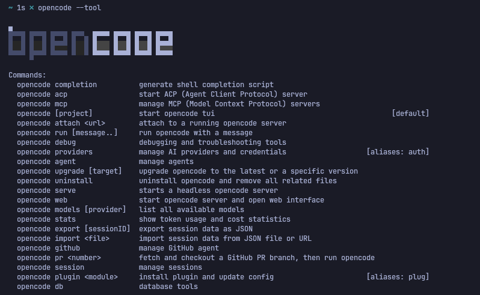

# OpenCode

OpenCode is a CLI tool that lets you run AI agents directly from your terminal. It's great for quick tasks, code generation, and even local code assistance.

It works inside the terminal but allows you to manage AI models, run conversations, and even attach files for context.

> [!note]
> Verify any command and for comprehensive help,
>
> ```bash
> opencode --help
> opencode [option] --help # to get commands for a specific option like agents, plugins, etc
> ```
>
> Learn more about [OpenCode, its workings & usage](https://opencode.ai/docs)

## File Locations in OpenCode

| Component           | Location                                                                                    |
| ------------------- | ------------------------------------------------------------------------------------------- |
| **Config (Global)** | `~/.config/opencode/opencode.json`                                                          |
| **Config (Local)**  | `.opencode/opencode.jsonc` or `.opencode/opencode.json` (project root)                      |
| \*\*Agents          | `~/.config/opencode/agents/<name>.md`                                                       |
| \*\*Skills          | `~/.config/opencode/skills/<name>/SKILL.md`, also supports ~/.claude/skills/<name>/SKILL.md |
| **Project Config**  | `.opencode/opencode.jsonc` or `AGENTS.md`                                                   |

**Load order:** Local config loads first, then global. Duplicate plugins with same name load once.

**Example:** Model set to `opencode/big-pickle` globally, overridden to `anthropic/claude-haiku-4` locally for one project.

## TUI Commands

Some basic commands to get you started:

| Command            | Description                            |
| ------------------ | -------------------------------------- |
| `/init`            | Initialize project (creates AGENTS.md) |
| `/undo`            | Undo last change                       |
| `/redo`            | Redo                                   |
| `/share`/`unshare` | Share/Unshare conversation             |
| `/sessions`        | List all sessions                      |
| `/connect`         | Add/update provider API key            |
| `/models`          | List available models                  |
| `/themes`          | List available themes                  |

But actually useful commands are as follows:

| Command     | Description                                               |
| ----------- | --------------------------------------------------------- | ------ | --- |
| `/compact`  | Compact the current session                               |
| `/review`   | Review the current session, default uncommited,options commit,branch,pr  |
| `/export`   | Export chat context as Markdown                           |
| `/new`      | Start new session                                         |
| `/variants` | List and switch between model variants (some unsupported) |
| `/agents`   | List all agents (only primary)                            |
| `/mcp`      | List MCP servers                                          |
| `/status`   | View mcp servers, formatters, installed plugins         |

You can also define your own custom commands.

### Keyboard Shortcuts

| Shortcut              | Action                             |
| --------------------- | ---------------------------------- |
| `Tab`                 | Switch between agents              |
| `Ctrl+X U`            | Undo                               |
| `Ctrl+X R`            | Redo                               |
| `@filename`, `@dir`   | Reference a file, dir in chat      |
| `@subagents`          | Call subagents                     |
| `Ctrl+X` + Arrow Keys | Open/close/switch subagent screens |
| `Ctrl+P`              | Open commands menu                 |
| `Ctrl+T`              | Switch model variants              |

Ctrl+X ↑ To open subagents when deployed within the session, then press with down arrow key to close the subagent screen, use left/right arrow key to switch screen of the subagents deployed.

One of the useful commands there in commands menu are:

- Stash prompt
- Stash pop
- Stash list

They do not have keybindings or shorcuts yet.

## OpenCode CLI Guide

Before you give any prompt to opencode you may want to set up the model you want to use,
Opencode provides you with some free models to choose from, and you can also add your own custom models.

To add your own,

```bash
opencode /connect       # Add provider API key or its setup
opencode /init          # Create AGENTS.md for project
```

To open the TUI, just run:

```bash
opencode run
```

It will open a terminal UI where you can interact with the AI.

You can also run one-shot commands directly from the terminal without opening the TUI.

```bash
opencode run "$prompt"
opencode run $prompt
```

`-c` = **continue last session**

So instead of starting over, you can continue from where you left off.

```bash

opencode run "Explain git branches simply"
opencode run -c "Now give an example"

```

It becomes a **terminal AI conversation** instead of one-shot commands. Much smoother.

This is especially useful for quick tasks or when you want to integrate it into scripts.

## Scripting with OpenCode

On the topic of scripts, you can also use it in a more structured way with the `--format json` flag, which outputs the response in JSON format, making it easier to parse and use in other tools.

```bash
opencode run "Introduce how knowing github, gitlab and version control is nothing special" --format json
```

or

```bash
opencode run --format json "Introduce how knowing github, gitlab and version control is nothing special"
```

### API OpenCode (scripting, dev tools, etc)

```bash
opencode run 'say "Hello, World!"' --format json | jq -c 'select(.type=="text") | {result: .part.text}'
```

The output will be,

```output
{"result":"Hello, World!"}
```

# Link Files/Folders for Context

Run the agent **inside a project directory**:

```bash
opencode run --dir . # run inside the directory
opencode run --dir ~/projects/myapp "Explain this codebase" # run inside the specific directory
```

You can also attach files:

```bash
opencode run "Explain how this program works" -f main.rs -f Cargo.toml # attach specific files for context
```

Now it behaves like a **local code assistant**. It can read your files, understand the codebase, and give you insights and help you with coding tasks.

## OpenCode tools

Find all the tools available in OpenCode with:

```bash
opencode --tools
```



## Export Context

You can export chat context in two ways:

1. **From TUI** (inside OpenCode): `/export` - exports as Markdown
2. **From CLI**: `opencode export [sessionID]` - exports as JSON

If no session ID is provided, you'll be prompted to select a session.


Learn about all [OpenCode CLI commands](https://opencode.ai/docs/cli/) and [TUI features](https://opencode.ai/docs/tui/).


opencode run \
  --model provider/model \
  --dangerously-skip-permissions \
  --format json \
  "your question - answer only yes or no"

## Agents

### Viewing & Creating Agents

```bash
opencode agent list           # List all agents in JSON format
opencode agent create         # Interactive agent creation
```

### Agent Configuration

**Via JSON config** (`~/.config/opencode/opencode.json`):

```json
{
  "agent": {
    "my-agent": {
      "description": "What this agent does",
      "mode": "subagent",
      "model": "anthropic/claude-sonnet-4-20250514",
      "prompt": "Your instructions here...",
      "permission": {
        "edit": "allow|ask|deny",
        "bash": "allow|ask|deny",
        "webfetch": "allow|ask|deny"
      }
    }
  }
}
```

**Via Markdown** (`~/.config/opencode/agents/<name>.md` or `.opencode/agents/<name>.md`):

```markdown
---
name: agent-name
description: What this agent does
model: anthropic/claude-sonnet-4-20250514
mode: subagent
---

Your detailed instructions here...
```

## Permissions

Control what agents can do with permissions:

```json
{
  "permission": {
    "edit": "allow|ask|deny",      # File editing
    "bash": "allow|ask|deny",      # Shell commands
    "webfetch": "allow|ask|deny"   # Web requests
  }
}
```

- `allow` - Automatic permission
- `ask` - Prompt user each time
- `deny` - Always block

### Built-in Agents

- `build` - Code generation & implementation
- `plan` - Implementation planning
- `compaction` - Code optimization
- `summary` - Content summarization
- `title` - Title generation
- `explore` - Codebase exploration (subagent)
- `general` - General purpose (subagent)

## Skills

Skills are reusable knowledge packages stored in SKILL.md files.

### SKILL.md Format

```markdown
---
name: skill-name
description: What this skill does
version: "1.0.0"
---

# Skill Title

Detailed instructions and guidance...
```

## Documentation Index

Comprehensive reference for all OpenCode features:

| Area                    | URL                                       |
| ----------------------- | ----------------------------------------- |
| **Getting Started**     | https://opencode.ai/docs/                 |
| **Configuration**       | https://opencode.ai/docs/config/          |
| **Tools Reference**     | https://opencode.ai/docs/tools/           |
| **Agents**              | https://opencode.ai/docs/agents/          |
| **Custom Commands**     | https://opencode.ai/docs/commands/        |
| **Skills**              | https://opencode.ai/docs/skills/          |
| **MCP Servers**         | https://opencode.ai/docs/mcp-servers/     |
| **Permissions**         | https://opencode.ai/docs/permissions/     |
| **Themes**              | https://opencode.ai/docs/themes/          |
| **Keybinds**            | https://opencode.ai/docs/keybinds/        |
| **Terminal UI (TUI)**   | https://opencode.ai/docs/tui/             |
| **Code Formatters**     | https://opencode.ai/docs/formatters/      |
| **LSP Configuration**   | https://opencode.ai/docs/lsp/             |
| **Custom Tools**        | https://opencode.ai/docs/custom-tools/    |
| **Ecosystem/Plugins**   | https://opencode.ai/docs/ecosystem/       |
| **Troubleshooting**     | https://opencode.ai/docs/troubleshooting/ |
| **Windows/WSL**         | https://opencode.ai/docs/windows-wsl/     |
| **LLM Providers**       | https://opencode.ai/docs/providers/       |
| **Model Configuration** | https://opencode.ai/docs/models/          |
| **Server Setup**        | https://opencode.ai/docs/server/          |
| **CLI Reference**       | https://opencode.ai/docs/cli/             |
| **Web Interface**       | https://opencode.ai/docs/web/             |
| **IDE Integration**     | https://opencode.ai/docs/ide/             |
| **GitHub Integration**  | https://opencode.ai/docs/github/          |
| **GitLab Integration**  | https://opencode.ai/docs/gitlab/          |

## Resources

- **Main Docs:** https://opencode.ai/docs/
- **GitHub Repo:** https://github.com/anomalyco/opencode
- **Discord Community:** https://opencode.ai/discord
